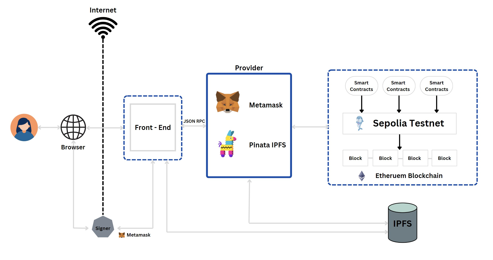

# Nottingham s-CPD website

## Introduction
The objective of this decentralized app dApp project is to enhance the s-CPD point system by incorporating blockchain and cryptocurrency technologies. This enhancement aims to make the s-CPD point system more attractive to students, thereby further encouraging them to engage in activities that benefit both themselves and the community. 
This project revitalizes the s-CPD point system by integrating <b>React</b> for a dynamic front-end, <b>MetaMask</b> for blockchain transactions, and <b>Pinata</b> for decentralized data storage. Smart contracts facilitate secure, automated interactions for event creation, voting, enrollement, questionnaire creation and tokens claiming, enhancing student engagement with a gamified and transparent experience. 
The system architecture employs an MVC design pattern where the smart contracts act as the Model, responsible for data rules and business logic with respect to the blockchain. The JavaScript functions serve as the Controller, handling the data exchange between the UI and the blockchain. The React components represent the View, providing an interactive user interface for a seamless user experience.

## Compilation and Run Instructions 
### Prerequisites
Before you begin, ensure you have met the following requirements:
* You have installed the latest version of [Node.js and npm](https://nodejs.org/).

### Project Installation
#### Manually
1) Download the zip file
2) Unzip and extract the folder into a location in your computer that you remember
3) Download and Visual Studio Code
4) Click "Open" and click on the folder that you have extracted just now

#### Using git 
1) git clone https://github.com/Cheeheng03/Nottingham-s-CPD-Website
2) cd Nottingham-s-CPD-Website
3) npm install

### Running the Project
1) Open a new terminal in your Visual Studio Code
```
Terminal -> New Terminal or Ctrl + Shift + `
``` 
2) Execute
```
npm start
```
This will run the app in the development mode.
Open http://localhost:3000 to view it in your browser.

The page will reload when you make changes.
You may also see any lint errors in the console.

### Building the Project
1) Open a new terminal in your Visual Studio Code
```
Terminal -> New Terminal or Ctrl + Shift + `
``` 
2) Execute
```
npm run build
```
This builds the app for production to the build folder.
It correctly bundles React in production mode and optimizes the build for the best performance.

The app is ready to be deployed!

## Directory Structure
- `contracts/`: Holds the Solidity smart contracts for the application's blockchain logic and functions.
- `Address&Abi/`: Contains JavaScript files that define the addresses and ABIs of the smart contracts, crucial for linking the blockchain's smart contracts to the JavaScript functions.
- `components/`: Reusable React components used across different parts of the application.
- `pages/`: React components that represent full pages of the application.
- `images/`: Stores static image files used in the application, including icons, logos, and other graphical elements.
- `utils/`: Contains utility functions and helpers which provide common, reusable logic like formatting dates, processing transactions, or handling errors.
- `hooks/`: Custom React hooks that encapsulate common stateful logic for reusability in multiple components.
- `services/`: Dedicated JavaScript files or modules for handling external API calls, smart contract interactions, or any other service-related tasks.
- `context/`: Includes React context files for managing and passing global application state without props drilling.

## Smart Contracts

The backbone of the application's interaction with the blockchain is a series of smart contracts. These contracts are the vital link between the front-end code and the blockchain, governing the logic for various system functionalities.

- `EventRegistry.sol`: Manages event-related data and operations, enabling the creation, modification, and lookup of event details.
- `NottinghamToken.sol`: Handles the custom cryptocurrency operations related to Nottingham Tokens, including the issuance, transfer, and balance management of tokens.
- `QuestionnaireContract.sol`: Controls the submission and retrieval of questionnaire questions and answers, facilitating the eligibility of claming tokens.
- `StudentRegistry.sol`: Maintains a registry of student profiles, allowing for the management of student-specific data within the system.
- `VotingContract.sol`: Orchestrates voting procedures, allowing stakeholders to make decisions in a decentralized and transparent manner.

Each contract is crafted to ensure seamless and secure transactions on the blockchain, providing a robust framework for the application's decentralized features.

## System Architecture
Below is an overview of the system architecture highlighting how the different components interact within the application:



## Usage

This application is designed for two types of users: governance bodies responsible for event creation, voting and management and students who participate in events and claim tokens. The following steps outline the processes for each.

### For Governance Bodies:

1. **Event Creation**: Navigate to the Event Creation page to create a new event.
2. **Event Voting**: Proceed to Event Voting to determine the token allocation for each event.
3. **Questionnaire Creation**: After voting, move to the Questionnaire Creation section to formulate event-specific questionnaires.
4. **Finalizing the Event**: Once these steps are completed, the event is ready for student enrollment and participation.


### For Student Users:

1. **Joining Events**: Students should go to the Event Enrollment page to sign up for events.
2. **Marking Attendance**: With the commencement of the event, students can mark their attendance by navigating to the Claim Tokens page.
3. **Claiming Tokens**: To claim their tokens, students are required to complete the event questionnaire.
4. **Token Import**: Students can add NOTT tokens to their MetaMask wallet by using the "Import Tokens" feature and entering the Token Contract Address.

## Deployment

This application is deployed on netlify and connected with this GitHub repository.

Link: https://nottingham-scpd-event.netlify.app

## Built with 
<div style="display: flex; justify-content: start;">
  
  
  
  
</div>

 


